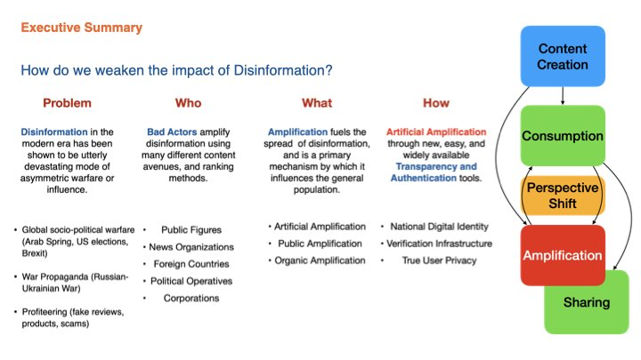

# Reducing the Impact of Disinformation: Tiered Privacy and Identity Verification Framework (TPIF)

This repository outlines the **Tiered Privacy and Identity Verification Framework** (TPIF), a strategic approach to increasing transparency and mitigating disinformation on the internet through the integration of **policy** and **technology**. Originally conceived as a keystone project during an MIT Systems Analysis course, this framework addresses modern challenges like **artificial amplification**, **privacy erosion**, and the inability to discern authentic content online.

TPIF is built around a decentralized, cryptography-driven architecture that provides **tiered identity verification**. It balances **anonymity**, **privacy**, and **accountability** to counteract the most pervasive elements of disinformation and restore trust to online ecosystems.

## 🚀 **Overview**

Disinformation is one of the most destabilizing tools in the modern era, used for:
- **Socio-political warfare** (e.g., global elections, Brexit, Russia-Ukraine war).
- **Economic manipulation** (e.g., fake reviews, scams, ad fraud).
- **Public opinion shaping** through artificial amplification of false or misleading content.

**Artificial amplification**—where bots, fake accounts, and AI-generated content simulate organic human activity—has compounded the problem, eroding public trust in information and making anonymity synonymous with inauthenticity.

### **The Solution**
The **Tiered Privacy and Identity Verification Framework (TPIF)** aims to mitigate these issues by:
1. Enabling **optional digital identity verification** while preserving privacy through advanced cryptographic methods (e.g., Zero-Knowledge Proofs, Homomorphic Encryption).
2. Leveraging a **federated hybrid blockchain** for secure, transparent authentication without centralizing control.
3. Providing **tiered levels of identity verification** (ranging from anonymous authenticity to public transparency) tailored to the unique needs of services and users.
4. Increasing accountability in **content creation**, **consumption**, and **amplification** while maintaining user autonomy.

This approach is not about perfection—it’s about harm reduction. By raising the cost and complexity of abuse, TPIF makes the internet harder to exploit, easier to trust, and more aligned with users' expectations for privacy and security.

## 📄 **Contents**

1. **Introduction and Problem Statement**: Lays out the scope of disinformation and its amplification.
2. **Background and Literature Review**: Explores the existing landscape of identity verification, cryptographic techniques, and blockchain solutions.
3. **Technical Framework**: Details the tiered privacy model, federated blockchain architecture, and cryptographic foundations.
4. **Implementation Plan**: Outlines a phased MVP approach to deploying the framework.
5. **Use Cases and Applications**: Demonstrates how TPIF applies to real-world scenarios like social media, e-commerce, and public governance.
6. **Advanced Features and Governance**: Highlights mechanisms like chain-of-custody verification, adaptive privacy routing, and consortium-led governance.

## 🛠️ **How to Access**

### 📜 **Documents**

#### White Paper (03/24/2025)
- [PDF Version](/documents/tiered-privacy-white-paper-3-24-2025.pdf)
- [Markdown Version](/documents/tiered-privacy-white-paper-3-24-2025.md)
- [Google Docs (Commenting Enabled)](https://docs.google.com/document/d/1kbegIwYDMV5HPNK9WCcTO8SkxNE-5e5t6NhdCoAOO5Q/edit?usp=sharing)

#### Initial Publication Documents (01/31/2025)
- [PDF Version](/documents/tiered-privacy-keeplist-deeb-2025.pdf)
- [Markdown Version](/documents/tiered-privacy-keeplist-deeb-2025.md)
- [Google Docs (Commenting Enabled)](https://docs.google.com/document/d/1_cY07HppjdYDbIvaDpfCnhPvB6B5BLl7D-HtTefz-jQ/edit?usp=sharing)

### 📁 **Keystone Project Slides**
- [View Slides in Original Format](./src_slides)

## 🔍 **Key Features**

### **Privacy and Transparency**
- **Anonymity Options**: Supports platforms like Reddit or whistleblowing services where users can remain anonymous yet verified as real.
- **Unique Identity Verification**: Prevents bot manipulation by ensuring each identity is unique to a service without requiring personal data.
- **Selective Disclosure**: Users can verify specific attributes (e.g., age, residency) without revealing their full identity.

### **Scalable, Decentralized Architecture**
- Built on a **federated hybrid blockchain**, balancing decentralization with operational efficiency.
- Compatible with **W3C Decentralized Identifiers (DIDs)**, **OAuth 2.0**, and existing standards to ensure global interoperability.

### **Combatting Disinformation**
- Artificial amplification mechanisms (e.g., bot farms, coordinated AI campaigns) are countered through transparency tools that prioritize verified content.
- Creates a **chain-of-trust** for content while preserving the ability to operate pseudonymously or anonymously.

## ✍️ **How to Contribute**

We welcome feedback and collaboration to refine and scale this framework. Here's how you can contribute:
1. **Comment on the Google Doc**: Use the linked document to provide suggestions or edits.
2. **Report Issues**: Highlight gaps, bugs, or areas of improvement by opening an issue in this repository.
3. **Submit Pull Requests**: Refine sections, correct inaccuracies, or contribute new insights through pull requests.
4. **Join Discussions**: Use GitHub Discussions to engage in conversations about the framework's impact and potential.

## ⚙️ **Benefits**

### **The Internet at Large**
- Makes verifying user authenticity easy and scalable.
- Encourages de-prioritization of unverified content in search results and feeds.
- Provides **new datasets for AI-based content moderation**, improving disinformation detection.

### **Social Media Platforms**
- Prioritizes verified content in algorithms, reducing the influence of bots.
- Enables dynamic moderation of flagged users without compromising privacy.
- Decreases the amplification of harmful or misleading content.

## ⚖️ **License**

This project is licensed under the [MIT License](./LICENSE). See the LICENSE file for more details.

## 📬 **Contact**

For questions, collaboration, or further discussion, contact:
- **Author**: Michael Deeb  
- **Email**: [deeb@keeplist.io](mailto:deeb@keeplist.io)  
- **Website**: [Keeplist.io](https://keeplist.io)

