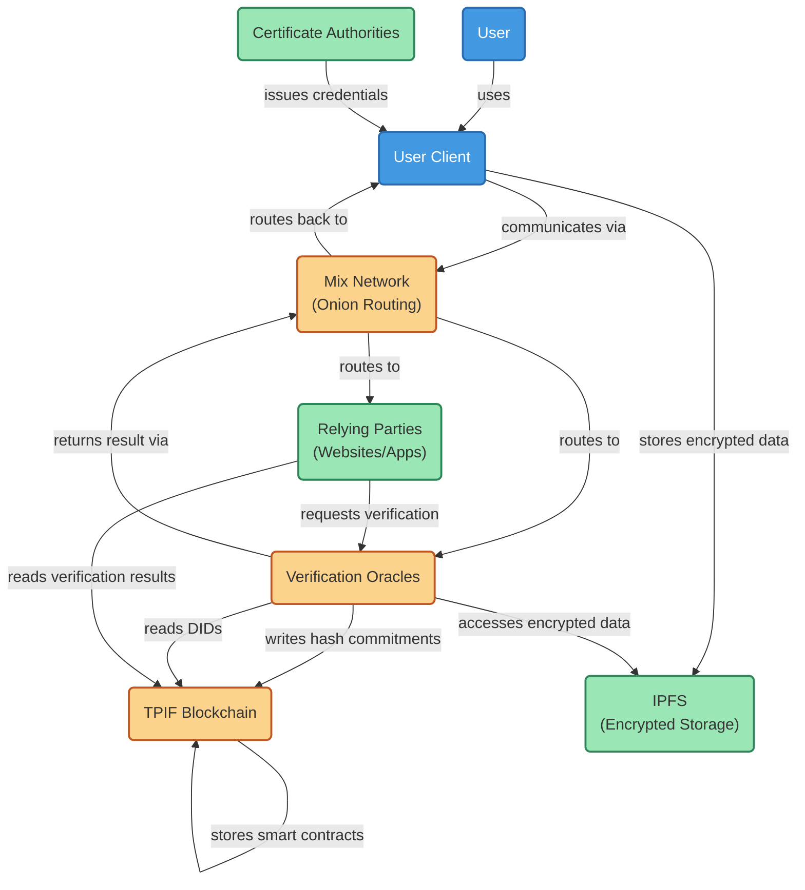

# TPIF System Architecture

This diagram illustrates the key components of the Tiered Privacy and Identity Framework (TPIF) and their interactions:

1. **User Client**: Browser extension or app that securely manages DIDs, private keys, and Verifiable Credentials
2. **Mix Network**: Provides onion routing for privacy-preserving communication
3. **Relying Parties**: Websites/applications requesting identity verification
4. **Verification Oracles**: Distributed nodes that verify credentials using MPC
5. **TPIF Blockchain**: Consortium-governed permissioned blockchain for DIDs and smart contracts
6. **Certificate Authorities**: Issue and manage Verifiable Credentials
7. **IPFS**: Decentralized encrypted storage for user data

The architecture provides multiple layers of privacy protection while enabling cryptographically verifiable authentication. All communications between components are routed through the Mix Network to ensure network-level anonymity through onion routing, which is critical for the privacy-preserving login protocol. 